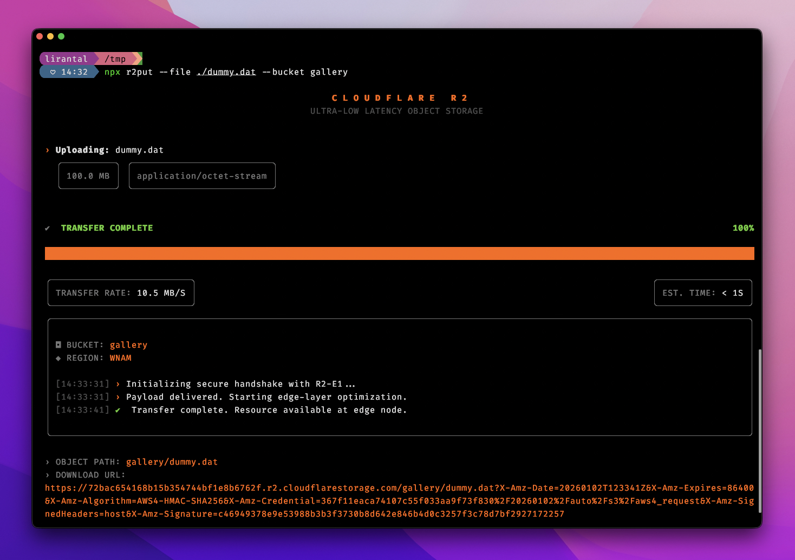

<!-- markdownlint-disable -->

<p align="center"><h1 align="center">
  ☁️ cfkit
</h1>

<p align="center">
  A modern toolkit for Cloudflare services — elegant APIs and powerful CLIs for the edge.
</p>

<p align="center">
  <a href="https://github.com/lirantal/cfkit/actions?workflow=CI"></a>
  <a href="https://snyk.io/test/github/lirantal/cfkit"></a>
  <a href="./LICENSE"></a>
  <a href="https://github.com/lirantal/cfkit"></a>
</p>

<div align="center">
  
</div>

## ✨ What's Inside

**cfkit** is a monorepo containing high-quality packages for working with Cloudflare services. Built with TypeScript, designed for Developer Experience.

| Package | Version | Description |
|---------|---------|-------------|
| [@cfkit/r2](./packages/r2) | [](https://www.npmjs.com/package/@cfkit/r2) | High-level Cloudflare R2 storage API wrapper |
| [r2put](./packages/r2put) | [](https://www.npmjs.com/package/r2put) | Futuristic CLI for uploading files to R2 |

---

## 📦 @cfkit/r2

> Clean, class-based interface for Cloudflare R2 storage. Hides S3-compatible complexity behind an intuitive API.

### Features

- 🚀 **Simple API** — Clean, intuitive interface
- 🔒 **Pre-signed URLs** — Secure, time-limited upload/download URLs
- ✅ **Type Safe** — Full TypeScript support
- 🌐 **Universal** — Works in Workers, browsers, Node.js, Deno, and Bun
- 📦 **Lightweight** — Minimal dependencies

### Quick Start

```bash
npm install @cfkit/r2
```

```typescript
import { R2Client } from '@cfkit/r2'

const r2 = new R2Client({
  accountId: 'your-account-id',
  accessKeyId: 'your-access-key-id',
  secretAccessKey: 'your-secret-access-key'
})

const bucket = r2.bucket('gallery')

// Generate pre-signed upload URL
const uploadUrl = await bucket.presignedUploadUrl({
  key: 'photo.jpg',
  contentType: 'image/jpeg',
  expiresIn: 3600
})

// Upload directly
await bucket.uploadFile('photo.jpg', file, {
  contentType: 'image/jpeg'
})

// Generate pre-signed download URL
const downloadUrl = await bucket.presignedDownloadUrl('photo.jpg')
```

📖 [Full documentation →](./packages/r2/README.md)

---

## 🚀 r2put

> A futuristic CLI for uploading files to Cloudflare R2 with animated progress bars and a polished terminal UI.

### Features

- 🎨 **Elegant TUI** — Futuristic terminal interface with animations
- 📊 **Real-time Stats** — Transfer rate and ETA display
- 🔗 **Presigned URLs** — Automatic download URL generation
- ⚡ **Built with React Ink** — Smooth terminal rendering

### Quick Start

```bash
npx r2put --file ./data.bin --bucket production-v4
```

```bash
# Set your credentials
export CLOUDFLARE_ACCOUNT_ID="your-account-id"
export R2_ACCESS_KEY_ID="your-access-key-id"
export R2_SECRET_ACCESS_KEY="your-secret-access-key"

# Upload with custom key
r2put -f ./image.png -b assets -k images/hero.png
```

### Output Preview

```
C L O U D F L A R E   R 2
ULTRA-LOW LATENCY OBJECT STORAGE

› Uploading: neural-net-weights.bin  [4.2 GB]

✔ COMPLETE                                                95%
████████████████████████████████████████░░░░░░░░░░░░░░░░░░░░

TRANSFER RATE: 842.4 MB/S                    EST. TIME: 4.2S

[13:53:02] › Initializing secure handshake with R2-E1...
[13:53:02] › Payload delivered. Starting edge-layer optimization.
[13:53:05] ✔ Deployment finalized. Resource available at edge node.

╔═══════════════════════════════════════════════════════════╗
║                      UPLOAD COMPLETE                      ║
╚═══════════════════════════════════════════════════════════╝
```

📖 [Full documentation →](./packages/r2put/README.md)

---

## 🛠️ Development

This monorepo uses [pnpm](https://pnpm.io/) and [Turborepo](https://turbo.build/) for efficient package management and builds.

### Prerequisites

- Node.js >= 22
- pnpm >= 10

### Setup

```bash
# Clone the repository
git clone https://github.com/lirantal/cfkit.git
cd cfkit

# Install dependencies
pnpm install

# Build all packages
pnpm build

# Run in development mode
pnpm dev
```

### Commands

| Command | Description |
|---------|-------------|
| `pnpm build` | Build all packages |
| `pnpm dev` | Watch mode for development |
| `pnpm lint` | Run linters |
| `pnpm test` | Run tests |
| `pnpm clean` | Clean build artifacts |
| `pnpm format` | Format code with Prettier |

---

## 🤝 Contributing

Contributions are welcome! Please feel free to submit a Pull Request.

1. Fork the repository
2. Create your feature branch (`git checkout -b feature/amazing-feature`)
3. Commit your changes (`git commit -m 'Add some amazing feature'`)
4. Push to the branch (`git push origin feature/amazing-feature`)
5. Open a Pull Request

---

## 📄 License

This project is licensed under the MIT License — see the [LICENSE](./LICENSE) file for details.

---

## 👤 Author

**Liran Tal** · [GitHub](https://github.com/lirantal) · [Twitter](https://x.com/liran_tal)

<p align="center">
  <sub>Built with ☕ and 💜 for the Cloudflare ecosystem</sub>
</p>

